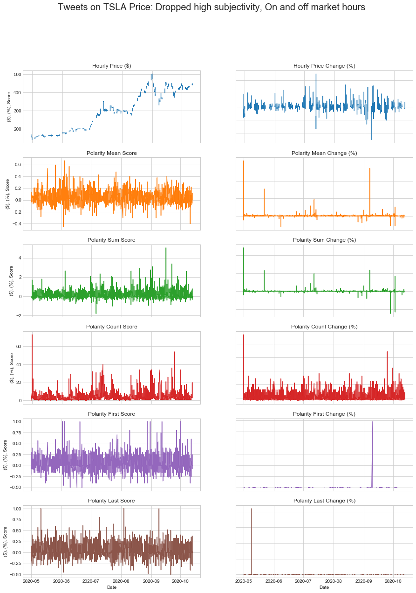
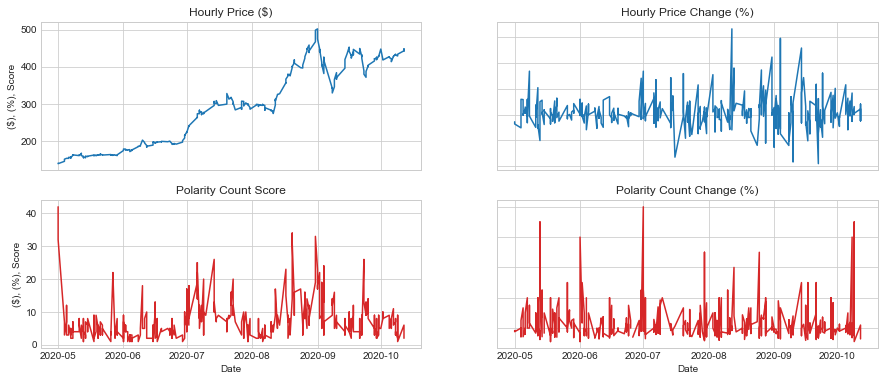

# Project 3 - NLP Analysis and Stock Data
## Alex Waters, Joe Swiderski, Marcus Kim, Mark Foxworth, Zach Cone
## October 18, 2020

---

## MOTIVATION AND SUMMARY

The goal of the project was determine if there is any correlation between the text sentiment of a given stock and the stock’s price movement.  

The project utilized various text sources such as comment threads from Yahoo Finance and Reddit, Twitter posts, and news articles to examine sentiment utilizing various machine learning models.  

This sentiment analysis was compared to stock price movements over time, including daily stock price movements and intertrade day movements, to review any possible correlation in the data. 
 The project focused on information related to Tesla with the intent to apply the same methodology to other stocks assuming any correlation was found.   

---
## QUESTIONS OF THE DATA

 1.  Is there a correlation between stock price movements and sentiment related to comments on yahoo finance, twitter, reddit, and news sources?
 
 2. Does Elon Musk Twitter comments drive the stock price more than social media?

 3. Can various comments and news articles be used to predict the movements of a stock price?
---
## DATA SOURCES, PACKAGES, and ANAYSIS METHODS

### *Data Sources*

- Yahoo Finance Comment Threads:  1 month, daily, 11,467
- Twitter Elon Musk: 3 yrs, dy/hr/min, 6906
- Twitter Tesla Company:  4 yrs, daily, 785
- Twitter "Tesla Price": 6 months, dy/hr/min, 41430
- Reddit "Tesla" Threads:  3 yrs, dy/hr/min, 2,253,039
 - Reuters news:  4 yrs, daily, 1321
 - News Articles via News API: 1 month, daily, 612

### *Python Packages*

- Sklearn
- BeautifulSoup
- Selenium
- News API
- NLTK
- Pandas
- Reddit API
- Numpy
- Plotly
- PRAW
- Yahoo Finance (Python)
- TextBlob
- TensorFlow

### *Analysis Methods*

- Visualizations using plots
- Train/Test methods
- Data frames
- Possible text tokenization
- Loops
- Sentiment Analysis
- Algorithmic trading

---
## Twitter History

Tesla Trade History: Hourly (2 years)

---

## *Reddit Data*

### Pushshift Reddit API
- https://github.com/pushshift/api
- q=‘TSLA|tesla’
- 01/01/2018
- 100 records per fetch
- 429 error – Too Many Requests

### Subreddits
- wallstreetbets
- stocks
- investing
- StockMarket
- CryptoCurrency

### PRAW
- Library
- inflexible
---
## *Twitter Analysis*

1. Decide which TSLA Price we use Daily / Hourly / 15 minutes

2. Preparing for various Sentiment Score Subjectivity and Polarity scores from TextBlob Going straight with Polarity score only Or tweaking and combining with Subjectivity score by filtering or weighting Simply taking more objective texts only (i.e. dropping out texts w/ Subjectivity > 0.4) Creating adj. Polarity score by weighting on subjectivity If  0 <= Subjectivity score <= 0.2  ⇒ 140% * Polarity score 0.2< Subjectivity score <= 0.4  ⇒ 120% * Polarity score and so on. Grouping scores by daily/hourly/15 mins by taking mean, sum, count, first and last
 
3.  Comparing the analysis by market hours
Analyze all texts regardless of on and off market hours or
Analyze only texts posted within market hours 

Tesla Tweets Market Hours Only

Tweets on tesla price:dropped hight subjectivity, market hours only

Tweets on TSLA Price: dropped high subjectvity, market hours only left to right top to bottom:hour price, hourly price change, polarity count score, polarity count change

Hourly return vs Polarity Mean Change(dropped high subjectivity)

Hourly Price vs Polarity count(dropped high subjectivity- market hours only)

There was a relatively strong correlation between hourly price change and the number of comments (corr=0.30) for mass tweets on the tesla price. 
---
## *Reddit Analysis*

Filtered Reddit data by wallstreetbets subreddit
Added the hourly Tesla stock price infor for the last two years to the dataframe.
Dropped null values and additional columns not needed. 
161,643 rows of data (test and stock movement)

*Findings:*

Some correlation between polarity counts (or number of posts) and stock Price (.66). 

Comparing this to the Elon Musk tweets, we found that the number of texts counts on TSLA’s hourly price had the strongest correlation. 

---

## *Twitter RNN_LSTM Conclusion*

Took Twitter text data and combined it with the movement, either up or down. 
Ran this through an LSTM model to see how accurate it could be at predicting stock movement based on Tweets from Twitter. 

Conclusion is the model was only accurate 52% of the time.

---

## *Word Cloud Visualizations*

Tesla Price Tweets

Tesla Reuters Headlines

Tesla Reuters Text

Tesla Yahoo Finance

---

## **WRAP UP AND OUTSTANDING QUESTIONS**

1. Review and testing of the “aftermarket” text data may provide additional lead indicators for next days opening.  
2. Is the sentiment score from TextBlob and Vader reliable enough to find any real correlations with the stock price? We observed not a few texts that weren’t classified correctly. 
3. For twitter, the API had a restriction on days(7 days), and web crawling also had a limit on the pages shown at a given period of a time, which made us difficult to get sufficient data. 
4. More time needed to clean the reddit data.  Reddit contained many posts that were noise and junk.
