# Project 3 - NLP Analysis and Stock Data
## Alex Waters, Joe Swiderski, Marcus Kim, Mark Foxworth, Zach Cone
## October 20, 2020

---

## MOTIVATION AND SUMMARY

The goal of the project was determine if there is any correlation between the text sentiment of a given stock and the stock’s price movement.  

The project utilized various text sources such as comment threads from Yahoo Finance and Reddit, Twitter posts, and news articles to examine sentiment utilizing various machine learning models.  

This sentiment analysis was compared to stock price movements over time, including daily stock price movements and intertrade day movements, to review any possible correlation in the data. 
 The project focused on information related to Tesla with the intent to apply the same methodology to other stocks assuming any correlation was found.   

---
## QUESTIONS OF THE DATA

 1.  Is there a correlation between stock price movements and sentiment related to comments on yahoo finance, twitter, reddit, and news sources?
 
 2. Does Elon Musk Twitter comments drive the stock price more than social media?

 3. Can various comments and news articles be used to predict the movements of a stock price?
---
## DATA SOURCES, PACKAGES, and ANAYSIS METHODS

### *Data Sources*

- Yahoo Finance Comment Threads:  1 month, daily, 11,467
- Twitter Elon Musk: 3 yrs, dy/hr/min, 6906
- Twitter Tesla Company:  4 yrs, daily, 785
- Twitter "Tesla Price": 6 months, dy/hr/min, 41430
- Reddit "Tesla" Threads:  3 yrs, dy/hr/min, 2,253,039
 - Reuters news:  4 yrs, daily, 1321
 - News Articles via News API: 1 month, daily, 612

### *Python Packages*

- Sklearn
- BeautifulSoup
- Selenium
- News API
- NLTK
- Pandas
- Reddit API
- Numpy
- Plotly
- PRAW
- Yahoo Finance (Python)
- TextBlob
- TensorFlow

### *Analysis Methods*

- Visualizations using plots
- Train/Test methods
- Data frames
- Possible text tokenization
- Loops
- Sentiment Analysis
- Algorithmic trading

---
## Historical Stock Price
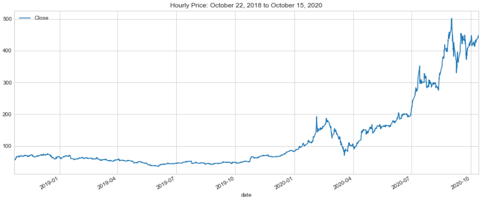
Tesla Trade History: Hourly (2 years)

---   
## *Twitter Data*
     
### [Elon Musk Tweets / Retweets](https://github.com/coolwonny/project-3/blob/main/Resources/Elon_Musk_tweets_cst_final.csv)
- https://twitter.com/elonmusk
- 01/01/2018 to 10/12/2020
- More SpaceX topics recently

### [Tesla Company Tweets](https://github.com/coolwonny/project-3/blob/main/Resources/tesla_tweets.csv)
- https://twitter.com/tesla 
- 11/16/2016 to 09/23/2020
- Less tweets in 2020

### [Mass Tweets on Tesla Price](https://github.com/coolwonny/project-3/blob/main/Resources/concat_query_tesla_price_final.csv)
- https://twitter.com/search?q=tesla%20price%20lang%3Aen%20until%3A2020-10-13%20since%3A2020-04-30&src=typed_query&f=live
- 05/01/2020 to 10/13/2020
- Search by 'Tesla Price'
- Limitation on page scrolls per hour by Twitter    
  (Optimized scroll rate without errors = 925 pixels every 5 seconds of timesleep)

---

## *Reddit Data*

### Pushshift Reddit API
- https://github.com/pushshift/api
- q=‘TSLA|tesla’
- 01/01/2018
- 100 records per fetch
- 429 error – Too Many Requests

### Subreddits
- wallstreetbets
- stocks
- investing
- StockMarket
- CryptoCurrency

### PRAW
- Library
- inflexible
---   
## *Yahoo Finance Data*    

### Tesla Stock Price (yfinance python)
 - Adjusted price after stock-split
 - Intervals available by [daily](https://github.com/coolwonny/project-3/blob/main/Resources/Daily_Stock_Data_4_Yrs.csv), [hourly](https://github.com/coolwonny/project-3/blob/main/Resources/Hourly_Data_by_year.csv) and minutes(5 min / [15 min](https://github.com/coolwonny/project-3/blob/main/Resources/fifteen_min_for_sixty_day.csv) / 30 min)
 - Limitations: hourly price up to 730 trading days, minutes price up to 60 trading days

### [Yahoo Finance Conversations](https://github.com/coolwonny/project-3/blob/main/Resources/Yahoo_conversations_cst.csv)
- https://finance.yahoo.com/quote/TSLA/community?p=TSLA
- 09/23/2020 to 10/09/2020
- Filtered by 'Recently Discussed'
- Dynamic pages ("Show More" button)  
- Timestamp not provided. Only with 'XX minutes/hours/days/months ago'

---
## *Reuters / News API Data*    

### [Reuters headlines and articles](https://github.com/coolwonny/project-3/blob/main/Resources/Tesla_reuter_full.csv)
 - https://www.reuters.com/companies/TSLA.OQ/news
 - The most recent four years
 - Returns headlines and bodies separately
 - Timestamp not provided. Only with 'XX hours/days/months/years ago'

### [News API articles](https://github.com/coolwonny/project-3/blob/main/Resources/tsla_newsapi.csv)
 - Limits on free version: up to current 30 days 
---
## ANALYSIS METHOD - Finding Out Correlations

### Things to be considered
- What sentiment score should we use?    
  (Subjectivity or Polarity, or both combined)    
- Which score value should we use to represent the same hourly(or daily) window, in case of having multiple scores?    
  (mean, count, add, take the first one or the last one, etc)   
- How to deal with texts generated off market hours including weekends?   
   
### Applied methods
1. Decide which TSLA stock price we use.
   ( Daily / Hourly / 15 minutes )

2. Prepare for various Sentiment Score   
   - Subjectivity and Polarity scores from TextBlob 
   - Going straight with Polarity score only 
   - Or tweaking and combining with Subjectivity score by filtering or weighting 
    a. Simply taking more objective texts only    
        -  (i.e. dropping out texts w/ Subjectivity > 0.4) 
    b. Creating adj. Polarity score by weighting on subjectivity   
        -  If  0 <= Subjectivity score <= 0.2  ⇒ 140% * Polarity score    
            0.2< Subjectivity score <= 0.4  ⇒ 120% * Polarity score   
            Likewise,  0.4 < subjectivity score <= 0.6 ⇒ 100%   
               0.6 < subjectivity score <= 0.8, ⇒ 80%   
               0.8 < subjectivity score <= 1.0, ⇒ 60% 
    
    - Grouping scores by daily/hourly/15 mins by taking mean, sum, count, first and last
 
3.  Compare the analysis by market hours
    - Analyze all texts regardless of on and off market hours or
    - Analyze only texts posted within market hours 

### *Sample results*
- Subplots overviewing the results of all scenarios
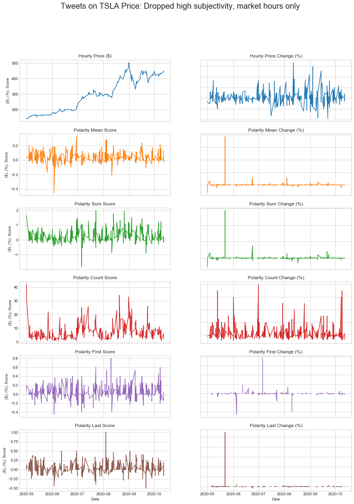   
- Sentiment Scatter Plot
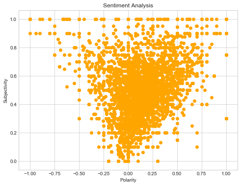
- Polarity Distribution over time
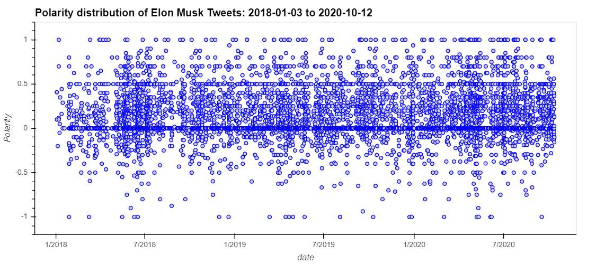
- Price, Sentiment Score overlay
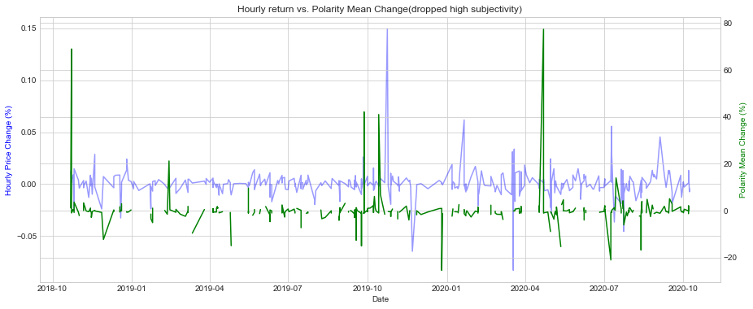
- Correlation Heatmap
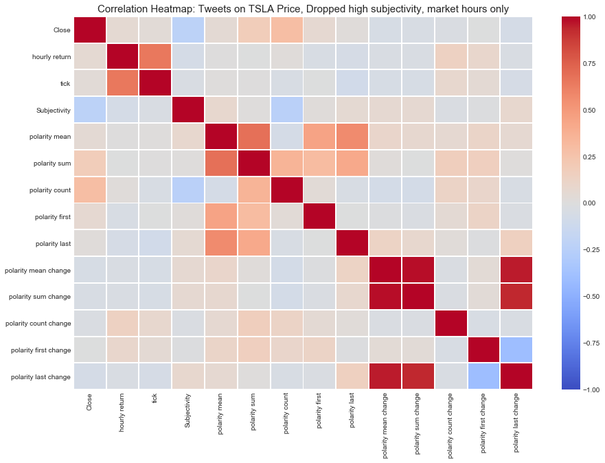

---

## *Twitter Analysis*

### Elon Musk Tweets / Retweets
- Strongest correlation from observation:  Hourly Price Return and Polarity Mean Change(%) (corr = 0.3058)
- Scenario: Dropped high subjectivity (<=0.4), market hours only
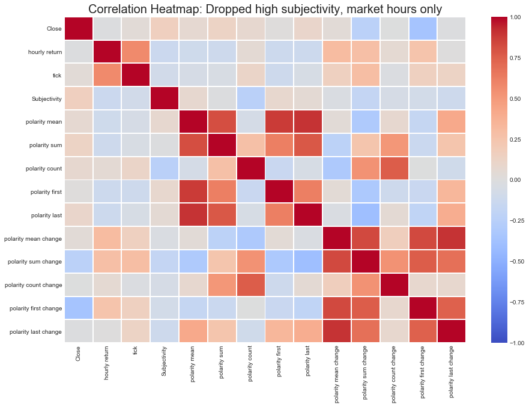

### Tesla Company Tweets / Retweets
- Strongest correlation:  Daily Price Return and Polarity Sum Change (corr = 0.1712)
- Scenario: Dropped high subjectivity (<=0.4), market days only
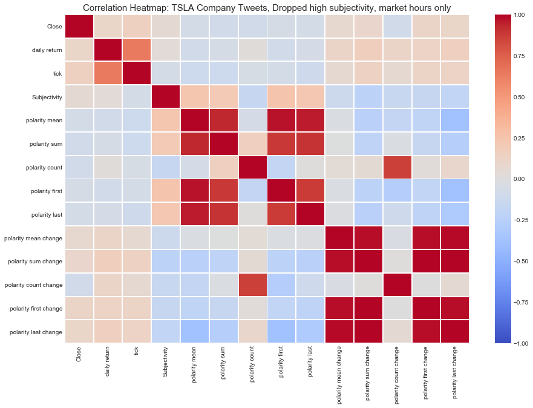
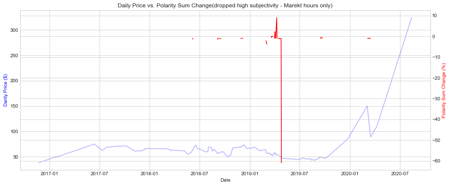

- We couldn't find any meaningful signals from the Company tweets mainly because of the scarcity of data even in the daily scale.

### Mass Tweets on Tesla Price
- Strongest correlation:  Hourly Price and Polarity Count (corr = 0.2956)
- Scenario: Dropped high subjectivity (<=0.4), market hours only

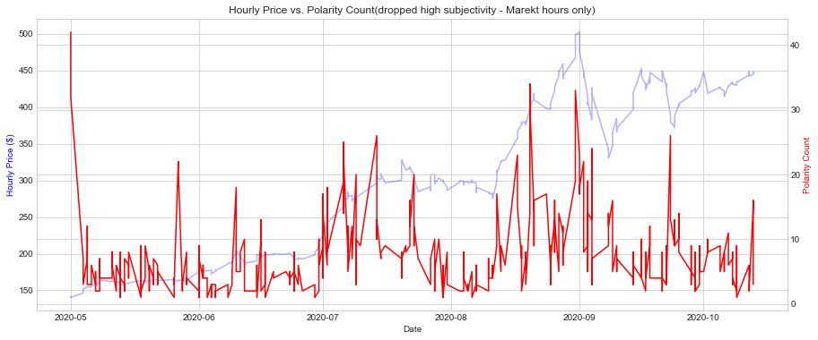

- Unlike the Elon Musk Tweets, mass tweets mostly correlated with the polarity count (or the number of texts). 

---
## *Reddit Analysis*

Since there were over 2.6 million Reddit texts, we filtered the data down by taking the "*wallstreetbets*" subreddit. Also, we further narrowed them down to two years as we had only 730 trading days of hourly price data available.

371K rows of data left after the filtering. We didn't observe any correlation between Polarity, Subjectivity, and hourly returns found in the filtered data frame. 

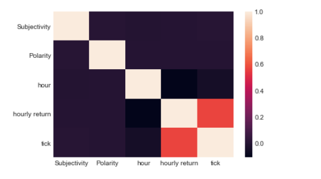

When we applied the analysis method, however, we found out the followings:

- Strongest correlation:  Hourly Price and Polarity Count (corr = 0.6654) followed by Hourly Price and Polarity Sum (corr = 0.3534)
-Scenario: Dropped high subjectivity(<=0.4), market hours only

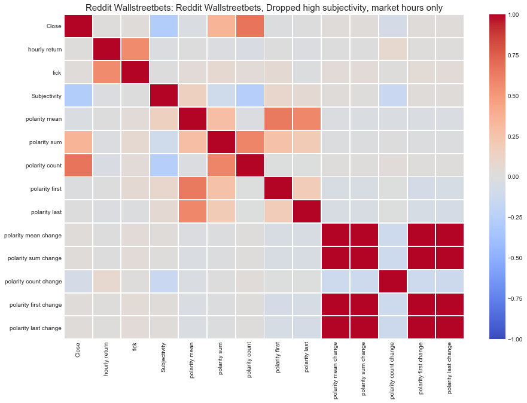

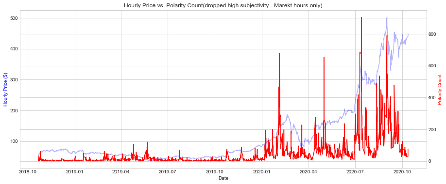

As a result, we found out the strongest correlation above all here in the Reddit data at 0.66 which is way above the others by more than twice. This is in line with the finding from the Mass Tweets that the number of texts in the given period of time does count on the stock price in the same window.

---
## *Intensive Analysis*

From all of the scenarios we had experimented, interestingly we detected stongest correlations under one scenario - Subjectivity(<=0.4) & market hours(or days) only. 

In addition, the strongest correlation was found on between the number of Mass Reddit texts and the hourly price movements. 

Given these results, we were motivated to take deeper analysis on:   

1) whether subjectivity really matters in relation to making sentiments more related to stock price;

2) whether the number of texts actually lead the price or the other way around;

### 1. Whether Subjectivity really matters

For Elon Musk Tweets, We have adjusted the subjectivity bar from 0.3 to 0.5 to see if there was any meaningful changes.    

When we increased the subjectivity bar to 0.3 from 0.4, the result became more interesting. Now the strongest correlation is still lying on between the same elements(hourly return and polarity mean), correlation got improved to 0.3606 from 0.3058.   
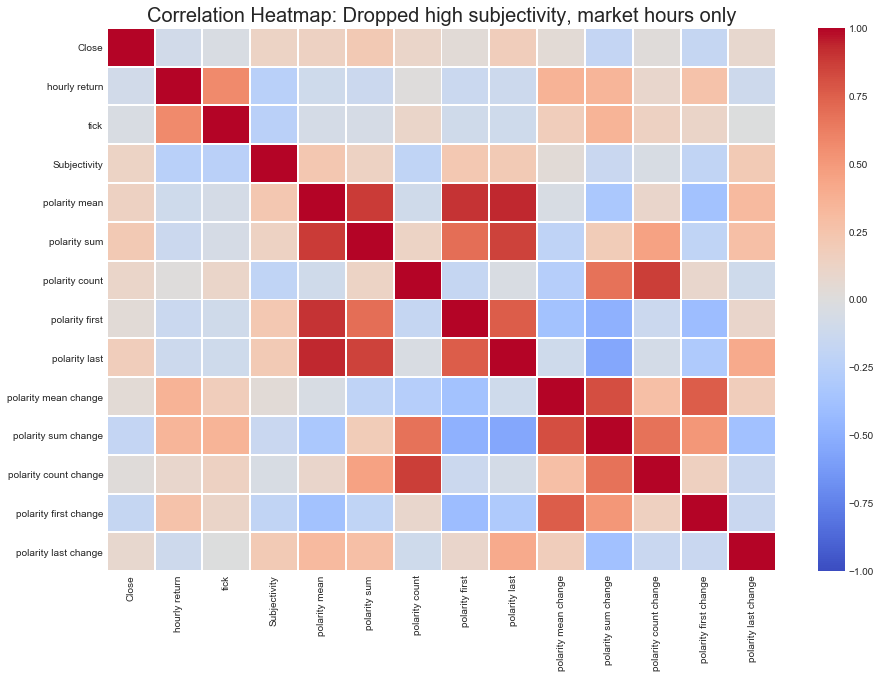
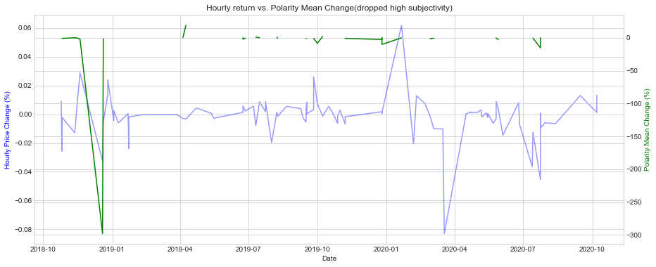

 By looking at the overlay plot, this could be attributed to either the number of data matters (when limited it 0.3) or people tends to be more responding to Elon Musk tweets specifically with more objective tones. 

 In comparison for Reddit data, when the subjectivity bar was modified from the range of 0.3 to 0.5, it didn’t outscored the correlation at 0.4.  

### 2. Whether the sentiment(number of texts) actually leads the price   

For this, we have applied `dt.ceil(freq ='15T')` to Reddit data, meaning rounded up every text date to the nearest ceiling value. For instance, if a text date is "00:05:39 (hh:mm:ss)" then it is rounded up to "00:15:00". if a text date is "00:16:02", then it becomes "00:30:00".    

Under this setting,  we might be able to assume the counts comes first, once we found the price and the counts are moving simultaneously.   

Next, We tried to figure out which drives the other, stock price or reddit texts. For doing this, we segregated the data into 15 minutes interval.
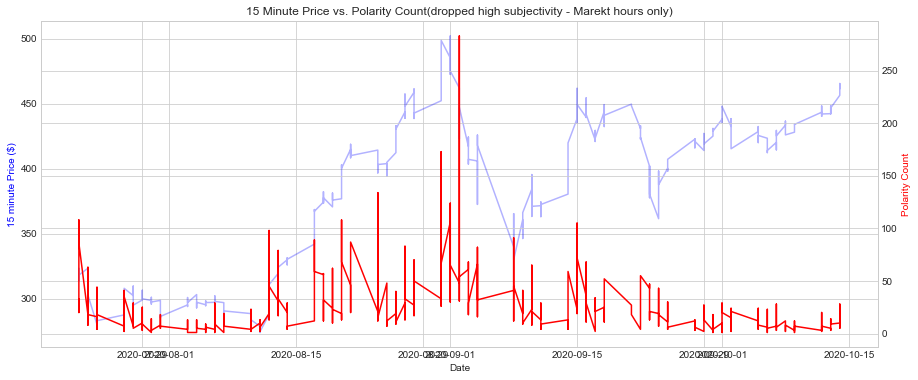

For example, if we go through what happened on 2020-08-20 where the price started rising from 9:45 am ($377.97 -> $385.95), the counts are also rising at the same time (22 -> 32). It is still hard to tell which one went first, but considering the counts in the previous, the real leap in counts was made at 10:00 (32 -> 66) when the price was already running high($394.56). 
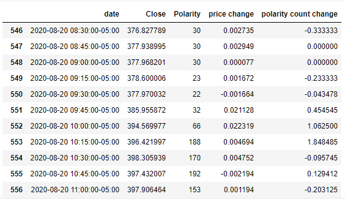

Although the daily high period for both is exactly the same at 14:00 ($402.88 and 202 counts), we could observe a period where the price was increasing while the counts decreased during 13:00 to 13:30.
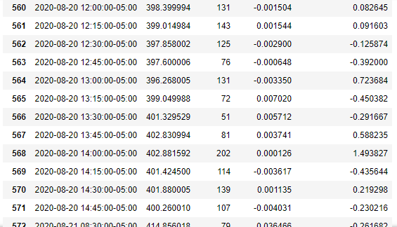

Another approach is looking at the changes in correlations. When aggregated by hour, they had a strong correlation at 0.66 as we observed previously. When segregated by 15 minutes, the correlation(Price vs. Counts) was plunged to 0.27, resulting in being stepped down from the strongest corelation by the correlation between '15 minutes price return vs. Polarity Mean Changes'(corr=0.3401). We consider this could be one of the supporting evidences that price movement comes slightly first before the texts. If that was not true, the correlation wouldn't have decreased so much.

---

## *Twitter RNN_LSTM Conclusion*

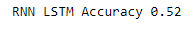

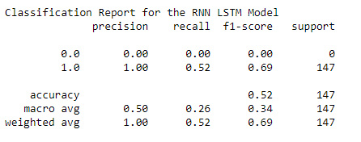

Took Twitter text data and combined it with the movement, either up or down. 
Ran this through an LSTM model to see how accurate it could be at predicting stock movement based on Tweets from Twitter. 

Conclusion is the model was only accurate 52% of the time.

---

## *Word Cloud Visualizations*

Tesla Price Tweets

Tesla Reuters Headlines

Tesla Reuters Text

Tesla Yahoo Finance

---
## Conclusion

Based on our research and analysis, we conclude as followings:

- TextBlob can be a good tool in terms of having subjectivity scores, comparing to Vader which only gives polarity-oriented ones.

- Less subjective texts tend to give more distinguishable results than those are not.

- Likewise, texts generated within market hours are more distinguishable in figuring out correlations than those are not.

- Positive Elon Musk(CEO) tweets in more objective tones have some impact on price (return). We may interpret it that **stock investors are more responsive to his positive tweets based on factual information than those with subjective sentiments**. 

- Mass texts from Twitter or Reddit showed a meaningful relationship between stock price and the number of texts. The more texts, the more price movement observed.

- We couldn't find any meaningful correlation out of Tesla Company Tweets in terms of stock price. The small number of data might have made it difficult to observe (Tesla company does not tweet often, especially for the last six months).

- We might be able to use the sentiment analysis as one of indicators in building an algorithmic trading.

---
## **WRAP UP AND OUTSTANDING QUESTIONS**

1. Review and testing of the “aftermarket” text data may provide additional lead indicators for next days opening.  
2. Is the sentiment score from TextBlob and Vader reliable enough to find any real correlations with the stock price? We observed not a few texts that weren’t classified correctly. 
3. For twitter, the API had a restriction on days(7 days), and web crawling also had a limit on the pages shown at a given period of a time, which made us difficult to get sufficient data. 
4. More time needed to clean the reddit data.  Reddit contained many posts that were noise and junk.
